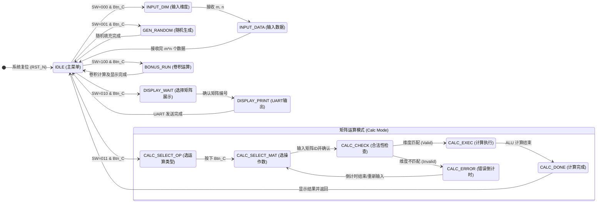

# Architecture Design Document 

**Project:** 基于 FPGA 的矩阵计算器 (Matrix Calculator based on FPGA)
**Course:** SUSTECH-CS207
**Language:** Simplified Chinese / Verilog HDL

---

## Part 1. The Input/Output device used in the project 

### 1. 输入输出设备位置示意
*   **UART (USB-TTL):** 位于板载 USB 接口，用于连接 PC 端串口调试助手。
*   **拨码开关:** 位于开发板下方，标记为 SW0 - SW7。
*   **按键开关:** 位于拨码开关上方或右侧，标记为 BTN_L, BTN_R, BTN_C (Confirm), BTN_U, BTN_D。
*   **LEDs:** 位于拨码开关上方，标记为 LD0 - LD7。
*   **7-Segment Display:** 位于开发板中部，共 8 位（2 组，每组 4 位）。

### 2. Explanations for input and output devices (输入输出设备功能说明)

| 设备类型     | 端口名称/物理位置   | 方向   | 详细功能说明                                                 |
| :----------- | :------------------ | :----- | :----------------------------------------------------------- |
| **UART**     | `rx` (Pin)          | Input  | **串口接收**：接收来自 PC 端串口助手的数据（矩阵维度、矩阵元素、操作指令）。 |
| **UART**     | `tx` (Pin)          | Output | **串口发送**：将矩阵数据、计算结果、菜单信息格式化后发送至 PC 端显示。 |
| **Switches** | `sw[7:5]` (SW7-SW5) | Input  | **模式选择**： 000: 矩阵输入/存储 001: 矩阵生成 (随机) 010: 矩阵展示 011: 矩阵运算 100: 附加功能 (卷积) |
| **Switches** | `sw[4:0]` (SW4-SW0) | Input  | **数据/参数设置**：在运算模式下选择运算类型 (加/减/乘/转置/标量)；在标量乘法中输入标量值。 |
| **Buttons**  | S2(R15)             | Input  | **确认键 **：确认当前模式选择、确认输入维度、确认开始计算。  |
| **Buttons**  | S6 #reset           | Input  | **系统复位**：全局复位，清空存储和状态机。                   |
| **LEDs**     | `led[0]`            | Output | **错误指示**：当矩阵维度不匹配、输入非法时亮起。             |
| **LEDs**     | `led[1]`            | Output | **运行状态**：指示系统正在计算或处于空闲状态。               |
| **7-Seg**    | `seg_out`, `seg_an` | Output | **信息显示**1. 显示当前选中的运算模式 (如显示 "A" 代表加法)。2. 错误发生时显示倒计时 (如 "Err 10" -> "Err 0")。 |

---

## Part 2. Describe the structure of the project 

### 1. 电路结构框图

###                           

### 2. Explain the functions and input/output ports 

#### 2.1 Top Module 
**Function:** 实例化所有子模块，处理全局时钟和复位，连接物理 IO 端口与内部逻辑信号。

| Module Name               | Input Ports                                                  | Output Ports                                                 | Function                                 |
| :------------------------ | :----------------------------------------------------------- | :----------------------------------------------------------- | :--------------------------------------- |
| **Matrix_Calculator_Top** | `clk` (1-bit) `rst_n` (1-bit) `rx` (1-bit) `sw` [7:0] `btn_c` (1-bit) | `tx` (1-bit) `led` [7:0] `seg_out` [7:0] `seg_an` [7:0] | 顶层模块，连接 FPGA 物理引脚与内部逻辑。 |

#### 2.2 数据接口模块
**Function:** 处理 UART 协议的串行数据收发，以及 ASCII 码与二进制数值的转换。

| Module Name          | Input Ports                                             | Output Ports                                                 | Function                                                     |
| :------------------- | :------------------------------------------------------ | :----------------------------------------------------------- | :----------------------------------------------------------- |
| **UART_RX**          | `clk`, `rst_n`, `rx`                                    | `rx_data` [7:0] `rx_done` (1-bit)                         | 接收 PC 端发送的 8 位串口数据。                              |
| **CMD_Parser**       | `clk`, `rst_n` `rx_data` [7:0] `rx_done`          | `matrix_val` [15:0] (元素值) `dim_val` [2:0] (维度) `data_valid` (1-bit) | 将接收到的 ASCII 字符 (如 '0'-'9') 转换为 4 位整数，用于后续存储。 |
| **UART_TX**          | `clk`, `rst_n` `tx_start` (1-bit) `tx_data` [7:0] | `tx` (1-bit) `tx_busy` (1-bit)                            | 将 8 位数据通过串口发送给 PC。                               |
| **Output_Formatter** | `clk`, `rst_n` `matrix_data` [15:0] `start_print` | `tx_data` [7:0] `tx_start`                                | 负责将矩阵数据格式化（添加空格、换行）并控制 UART_TX 发送。  |

#### 2.3 Core Logic Modules (核心逻辑模块)
**Function:** 实现状态控制、矩阵存储、算术运算及卷积功能。

| Module Name     | Input Ports                                                  | Output Ports                                                 | Function                                                     |
| :-------------- | :----------------------------------------------------------- | :----------------------------------------------------------- | :----------------------------------------------------------- |
| **Central_FSM** | `clk`, `rst_n` `sw` [7:0] `btn_c` `rx_valid`        | `current_state` [3:0] `mem_we` (写使能) `alu_op` [2:0] `err_flag` | 系统的核心大脑。解析用户按键和开关，控制系统状态流转，触发计算或显示。 |
| **Matrix_Mem**  | `clk` `addr_r` [7:0] `addr_w` [7:0] `data_in` [15:0] `we` | `data_out` [15:0] `dim_m` [2:0] `dim_n` [2:0]          | **存储模块**。使用寄存器数组存储矩阵 A, B 及结果 C。 地址映射规则：`Addr = Matrix_ID * 25 + Row * 5 + Col`。 |
| **Matrix_ALU**  | `clk` `op_code` [2:0] `mat_a_data` [15:0] `mat_b_data` [15:0] `scalar_val` [15:0] | `res_data` [7:0] `calc_done` `overflow`                | **计算核心**。执行加法、乘法、标量乘法、转置。包含合法性检测逻辑 (如维度检查)。 |
| **Bonus_Conv**  | `clk`, `rst_n` `start_conv`                               | `conv_res_data` [15:0] `conv_done`                        | **附加功能**。内部包含硬编码的 10x12 ROM 和 3x3 Kernel。执行卷积滑动窗口计算。 |
| **Timer_Unit**  | `clk`, `rst_n` `start_timer`                              | `time_left` [3:0] `timer_done`                            | 倒计时模块。用于错误显示时的 10 秒倒计时。                   |

#### 2.4 Display Modules 

| Module Name    | Input Ports                            | Output Ports                      | Function                                                     |
| :------------- | :------------------------------------- | :-------------------------------- | :----------------------------------------------------------- |
| **Seg_Driver** | `clk`, `rst_n` `display_val` [31:0] | `seg_out` [7:0] `seg_an` [7:0] | 动态扫描驱动 8 位数码管，显示倒计时数字或当前模式字符 (如 "C-A-L-C")。 |

---

## Part 3. FSM of the project (项目状态机设计)

### 1. List the states in your project

1.  **IDLE (主菜单):** 系统等待用户通过拨码开关选择功能 (sw[7:5]) 并按下确认键。
2.  **INPUT_DIM (输入维度):** 等待 UART 输入矩阵维度 ($m, n$)。
3.  **INPUT_DATA (输入数据):** 根据维度，循环接收 UART 输入的矩阵元素，写入 `Matrix_Mem`。
4.  **GEN_RANDOM (随机生成):** 根据用户输入的维度，使用 LFSR 算法自动填充矩阵数据。
5.  **DISPLAY_Wait (展示等待):** 等待用户选择要查看的矩阵编号。
6.  **DISPLAY_Print (串口打印):** 读取 `Matrix_Mem` 并通过 `Output_Formatter` 发送至 UART。
7.  **CALC_Select_OP (选择运算):** 等待用户通过拨码开关选择运算类型 (+, *, Transpose, etc.)。
8.  **CALC_Select_MAT (选择操作数):** 等待用户指定参与运算的矩阵编号 (如 A, B)。
9.  **CALC_CHECK (合法性检查):** 检查两个矩阵维度是否满足运算规则。
    *   若合法 , 转入 `CALC_EXEC`。
    *   若非法 , 转入 `CALC_ERROR`。
10. **CALC_ERROR (错误倒计时):** LED 点亮，数码管显示倒计时 (10s)。倒计时结束或用户修正输入后返回。
11. **CALC_EXEC (执行计算):** `Matrix_ALU` 运行。
12. **CALC_DONE (计算完成):** 将结果存入结果存储区，并触发 UART 打印结果。
13. **BONUS_RUN (卷积运行):** 运行硬件编码的卷积逻辑。

### 2. State Transition Diagram Description (状态转移描述)

---

### 2. State Transition Diagram (状态转移图)

---

### 图解说明 

1.  **主循环 **: 系统的核心是 `IDLE` 状态。系统上电复位后进入此状态，根据开发板拨码开关 `sw[7:5]` 的值决定进入哪种功能模式（输入、生成、展示、运算、卷积）。
2.  **输入路径 **: 进入 `INPUT_DIM` 等待用户通过串口输入维度，随后进入 `INPUT_DATA` 循环接收数据，直到计数器达到 `m*n` 后自动返回 IDLE。
3.  **运算闭环 **:
    *   这是一个复杂的子流程。用户先选运算类型 (`SELECT_OP`)，再选操作数 (`SELECT_MAT`)。
    *   **关键逻辑**在于 `CHECK` 状态：如果矩阵维度不符合运算规则（如加法时 A、B 维度不同），系统进入 `ERROR` 状态并触发倒计时（LED 亮起），强制用户重新选择；如果合法，则进入 `EXEC` 进行计算。
4.  **Bonus 路径**: 直接进入硬件固化的卷积计算逻辑 `BONUS_RUN`，完成后返回。